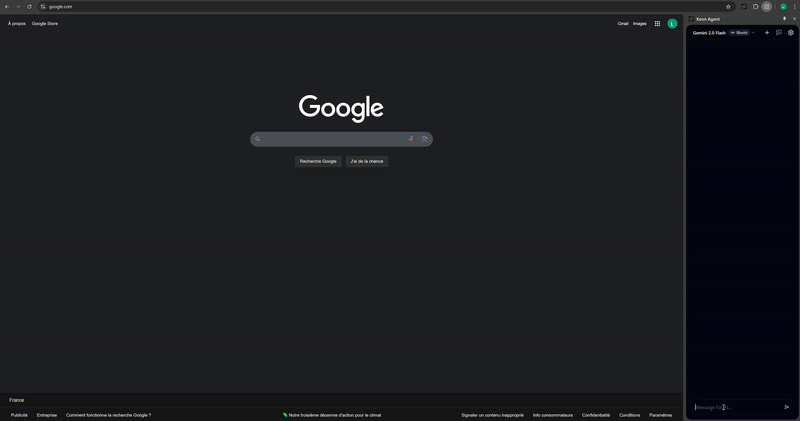

# Xeon Agent



Xeon Agent is a local Chrome side-panel extension for AI browser automation. It connects to the active tab through the Chrome debugger protocol, captures the page accessibility tree and optional annotated screenshot, asks an AI model for the next validated action sequence, executes it, and repeats until the task is done or needs user input.

## What changed

- Agent runtime rebuilt around Vercel AI SDK with OpenAI and Google providers.
- Strongly typed action schema with Zod validation.
- Agent orchestration moved out of React into `src/agent/AgentRunner.ts`.
- Browser capture, action execution, debugger connection, storage, and shared types are split into focused modules.
- Conversations and run history are persisted in `chrome.storage.local`.
- Settings now include provider/model, API key, screenshot toggle, and prompt editor.
- The AI SDK runtime is lazy-loaded so the side-panel startup bundle stays small.

## Development

```bash
npm install
npm run typecheck
npm test
npm run build
npm run dev
```

Load the built extension from `dist/chromium` or use `npm run dev` during development.

## Architecture

- `src/agent`: AI SDK client, prompt context, model registry, agent loop.
- `src/browser`: debugger connection, page capture, action executor.
- `src/storage`: settings, conversations, run history.
- `src/shared`: action schemas and shared app types.
- `sidebar`: React side-panel UI.

API keys are stored locally in Chrome extension storage. Conversation export/import should exclude keys by default.
